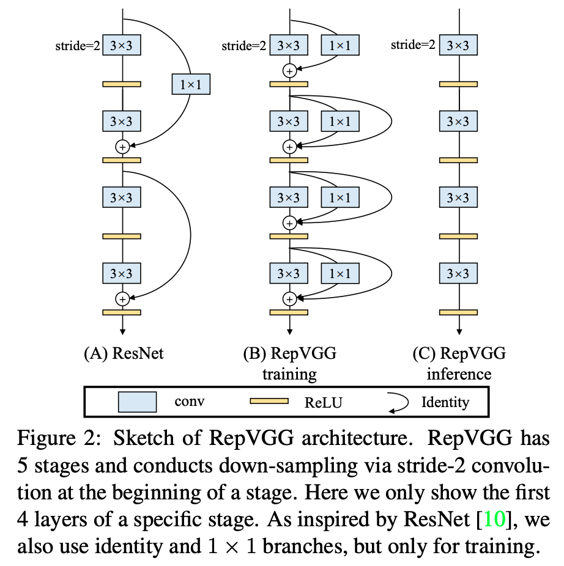

[TensorFlow 2] RepVGG: Making VGG-style ConvNets Great Again
=====

TensorFlow implementation of "RepVGG: Making VGG-style ConvNets Great Again"  

## Concept
<div align="center">
    
  <p>Sketch of the RegNet [1].</p>
</div>

## Performance

|Indicator|Value|
|:---|:---:|
|Accuracy|0.-----|
|Precision|0.-----|
|Recall|0.-----|
|F1-Score|0.-----|

```
```

## Requirements
* Python 3.7.6  
* Tensorflow 2.1.0  
* Numpy 1.18.1  
* Matplotlib 3.1.3  

## Reference
[1] Xiaohan Ding et al. (2021). <a href="https://arxiv.org/abs/2101.03697v1">RepVGG: Making VGG-style ConvNets Great Again</a>. arXiv preprint arXiv:2101.03697.
